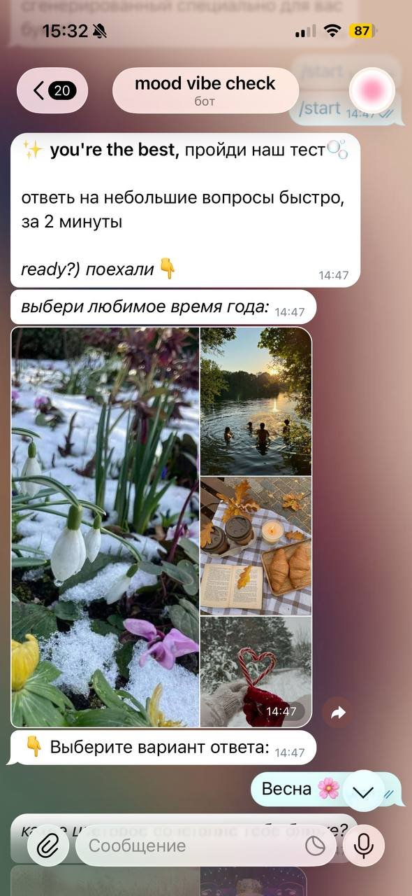
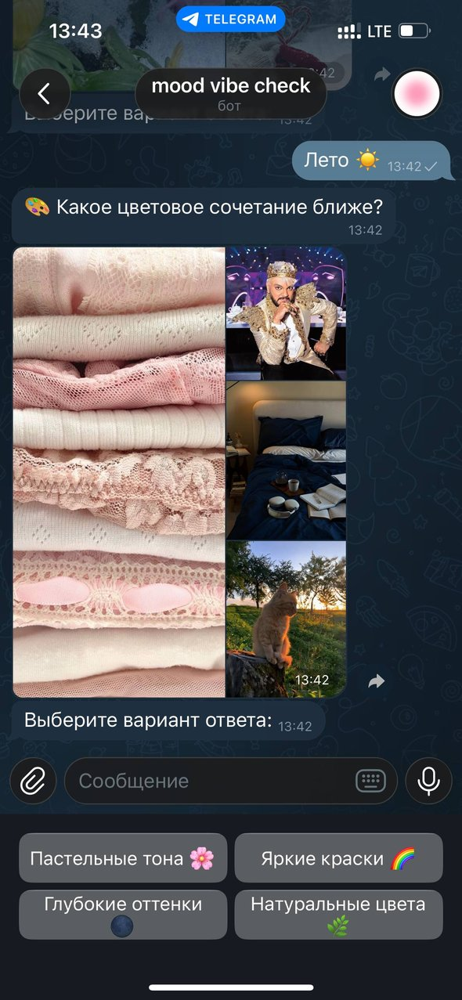
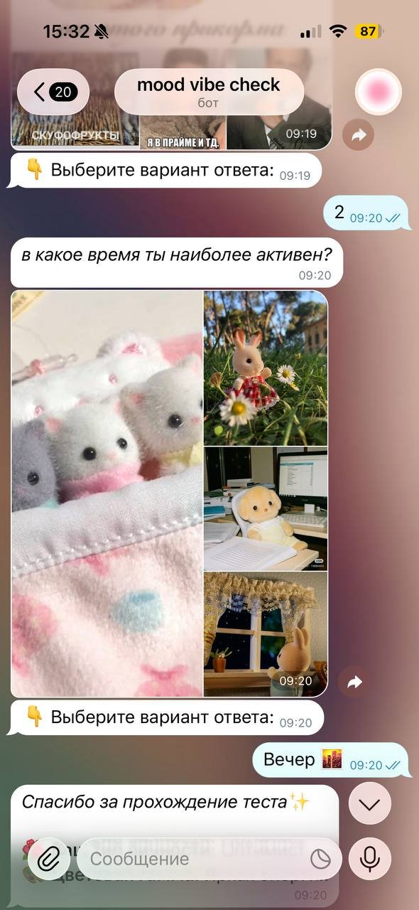
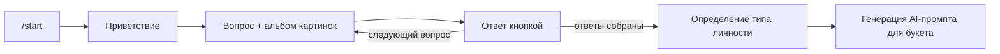

<div align="center">

# AI Flower Test Bot 🌸

**Telegram-бот, который через визуальный тест узнаёт характер человека и собирает из ответов AI-промпт для персонального букета**


Часть проекта [Flora Mind](https://github.com/katshuuu/floramind_project) — AI-сервиса генерации букетов

</div>

---

## Демо

<table>
  <tr>
    <td align="center" width="33%"></td>
    <td align="center" width="33%"></td>
    <td align="center" width="33%"></td>
  </tr>
  <tr>
    <td align="center"><sub><b>1. Старт</b><br>Приветствие по <code>/start</code> и первый вопрос</sub></td>
    <td align="center"><sub><b>2. Вопрос</b><br>Коллаж-альбом и варианты ответа на клавиатуре</sub></td>
    <td align="center"><sub><b>3. Финал</b><br>Последний ответ и результат теста</sub></td>
  </tr>
</table>

---

## О проекте

Бот проводит короткий тест (около 2 минут): к каждому вопросу прикладывается альбом из картинок, а пользователь выбирает ответ кнопкой. Вопросы касаются визуальных и бытовых предпочтений: любимое время года, близкое цветовое сочетание, время наибольшей активности и т. п.

По совокупности ответов бот определяет психологический тип личности и генерирует **AI-промпт** для создания персонализированного букета.

### Концепция

Тест оформлен как «Лаборатория психологии личности»: человек проходит лёгкий тест на характер и не догадывается, что по его ответам подбирается букет-сюрприз. Так получатель не узнаёт о подарке заранее, а букет отражает его вкусы, а не стереотипы дарителя.

## Как это работает



- **Визуальные вопросы** — каждый вопрос отправляется медиагруппой из нескольких изображений, чтобы ответ опирался на ассоциации, а не на рациональный выбор.
- **Reply-клавиатура** — варианты ответа в виде кнопок, пользователю не нужно ничего печатать.
- **Пошаговый сценарий** — бот хранит прогресс пользователя по тесту и переходит к следующему вопросу после ответа.

## Стек

| Компонент | Технология |
|-----------|------------|
| Язык | Go |
| Платформа | Telegram Bot API |
| Конфигурация | `.env` (`TELEGRAM_BOT_TOKEN`) |

## 🚀 Быстрый старт

### Локальный запуск

```bash
# Клонируем репозиторий
git clone https://github.com/katshuuu/FloraMind_chat.git
cd FloraMind_chat

# Устанавливаем зависимости
go mod download

# Создаём .env файл
cp .env.example .env
# Редактируем .env — добавляем TELEGRAM_BOT_TOKEN

# Запускаем
go run main.go
```

Токен бота выдаёт [@BotFather](https://t.me/BotFather) в Telegram.

## Связанные проекты

- [Flora Mind](https://github.com/katshuuu/floramind_project) — веб-сервис генерации букетов, для которого бот собирает данные

## Автор

**Екатерина Шусталова** — [GitHub](https://github.com/katshuuu) · [Telegram](https://t.me/katshuuu)
